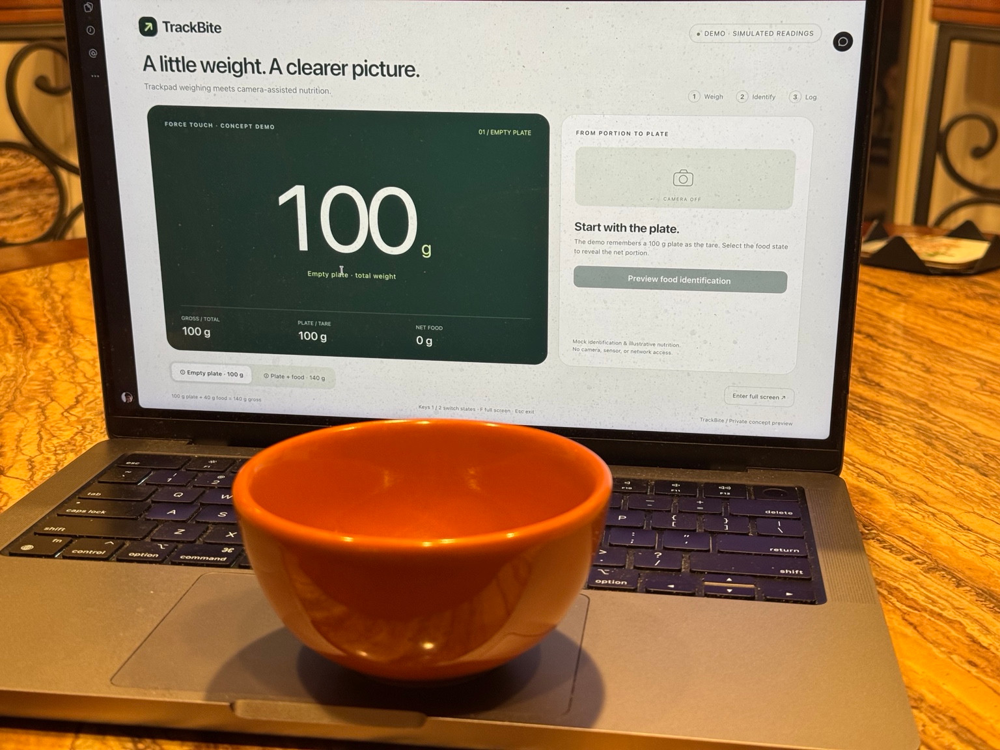
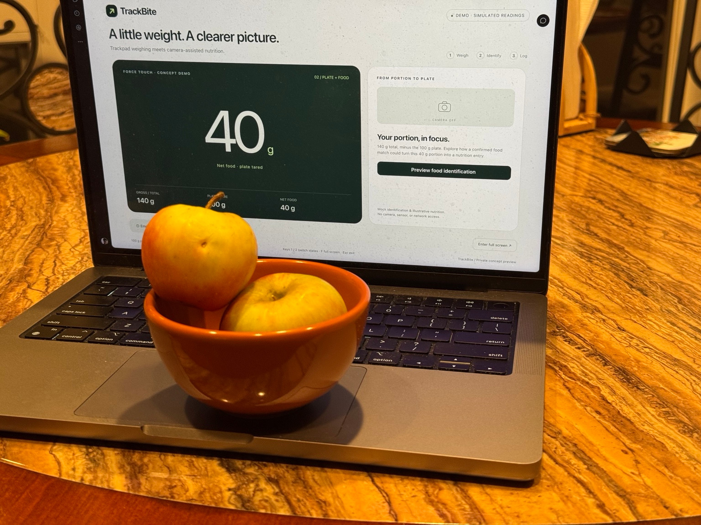
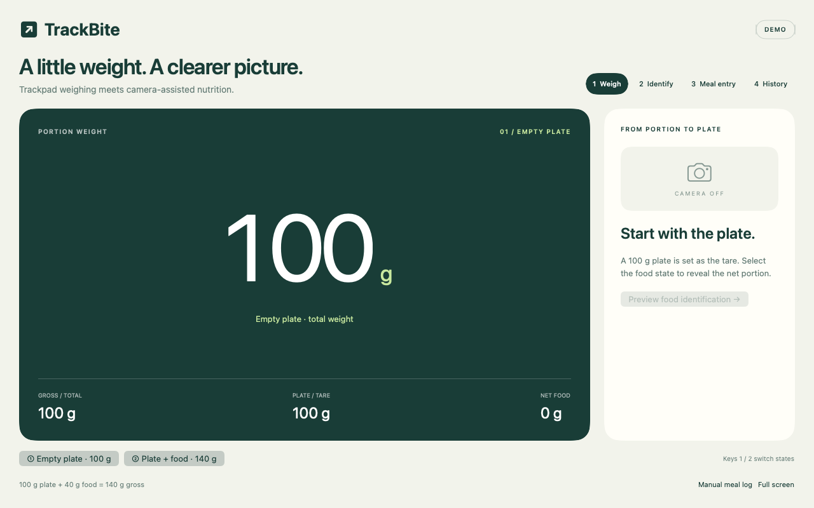
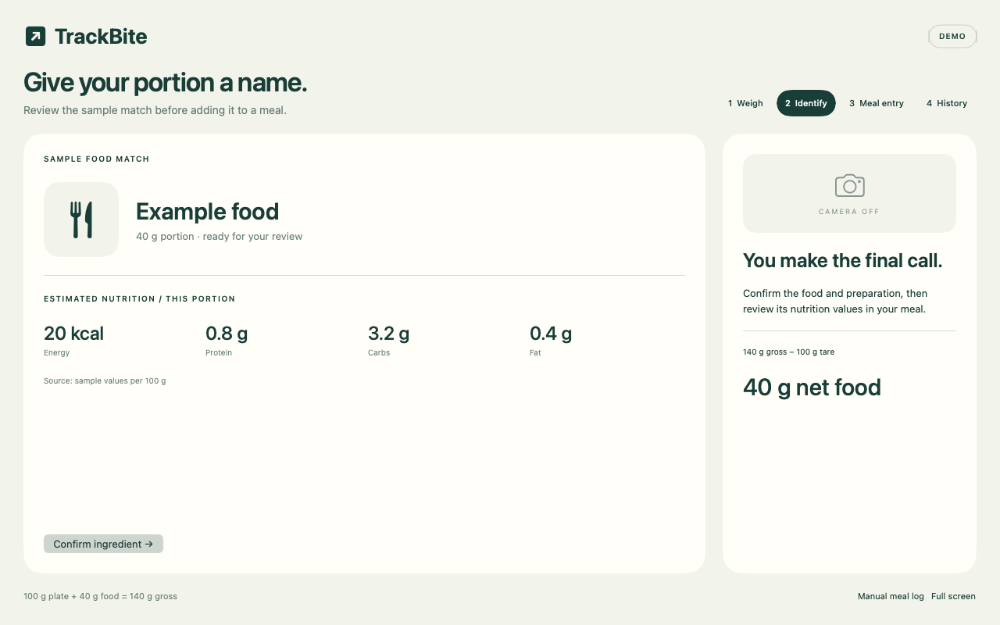
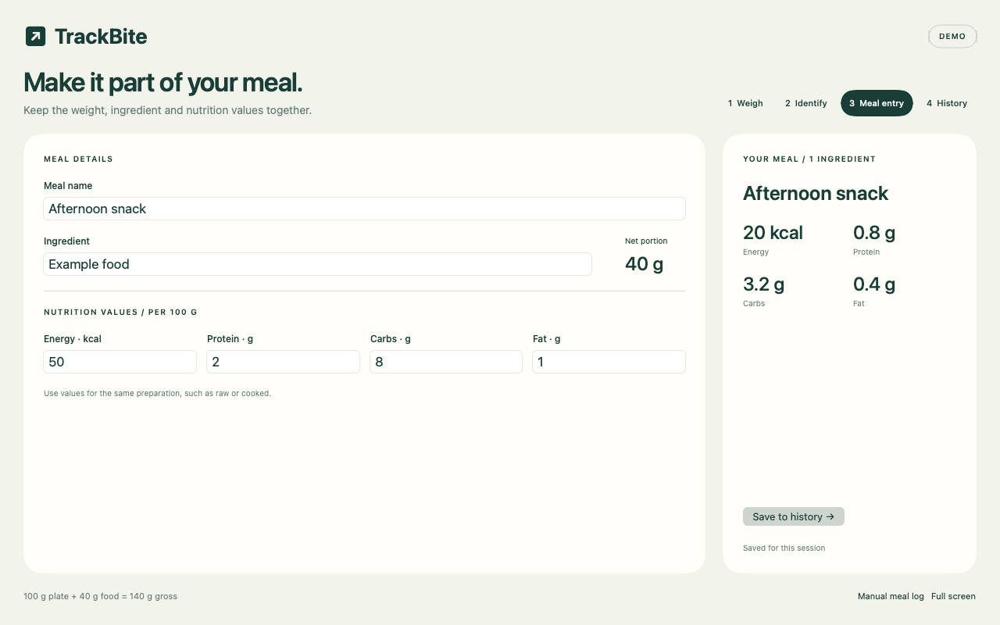
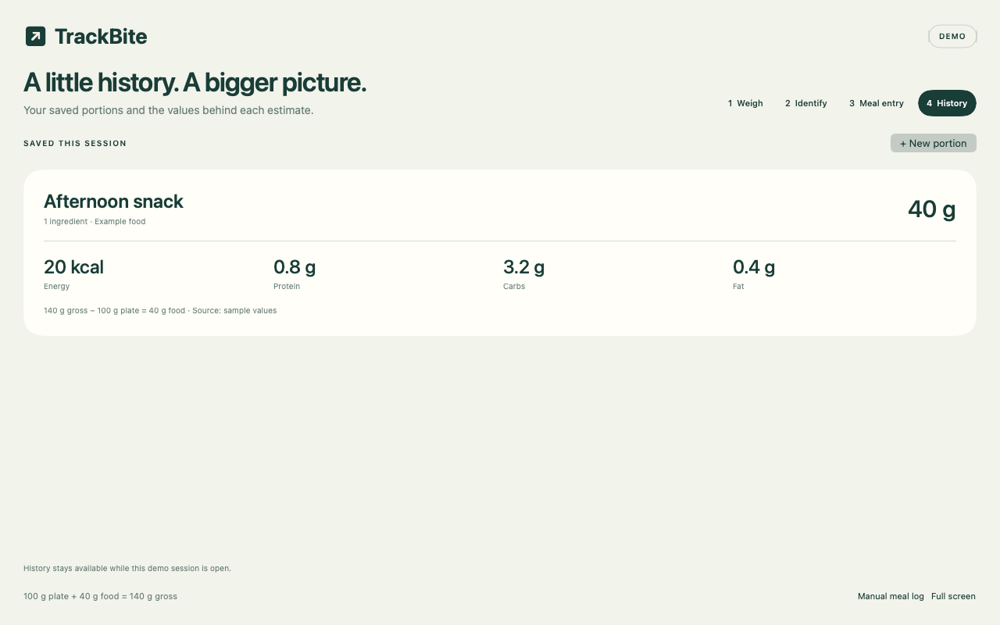

# TrackBite

TrackBite started with a student-life problem: I cared about nutrition and going to the gym, but had a limited budget and little equipment. I wondered whether my laptop’s trackpad could work like a weighing scale. That question later grew into the idea of using a camera to log food and track macros.

TrackBite brings weighing, food identification, meal entry and history into one green-and-cream workflow. The current demo uses simulated weights and a sample food match; live trackpad and camera integration are next steps.

## From plate to portion

<p>
  
  
</p>

*TrackBite demo: tare the container, then show the net portion. These staged photos show simulated readings.*

## The full workflow

1. **Weigh:** choose the 100 g plate or the 140 g plate + food state, giving 40 g net.
2. **Identify:** review and confirm the sample food match.
3. **Save:** name the meal, edit nutrition values, and keep the portion in history.

### Weigh

<p>
  
  
</p>

### Identify



### Ingredient & meal entry



### Saved history



*Actual rendered SwiftUI components, using a synthetic demo session. No personal meal records are shown.*

## Try it

Open the downloaded **[TrackBite-Demo.html](demo/TrackBite-Demo.html)** in Safari or Chrome. It works offline without a server, account or API key. Use **1 / 2** to switch weighing states and **F** for full screen. Saved entries remain in the session history while the page is open.

For the native app, use macOS 13+ with a Swift 5.9-compatible developer toolchain:

```sh
swift run TrackBite
```

The four-screen demo opens first. **Manual meal log** opens the persistent ingredient-entry workflow. Manual meals are stored locally in `~/Library/Application Support/TrackBite/meals.json`; demo history is kept separately in memory.

## Development

```sh
swift build
swift run NutritionChecks
node scripts/check-demo.cjs
```

The root package has no external dependencies. See [validation](docs/VALIDATION.md) for the UI captures and checks, and [integration notes](docs/CONCEPT-INTEGRATION.txt) for future device, camera and food-data work. Trackpad load limits, calibration and accuracy still need validation.

## Credits

TrackBite’s interface, nutrition workflow, mock adapters and documentation were developed with AI assistance. The weighing foundation is **TrackWeight by Krish Shah**, using **OpenMultitouchSupport by Takuto Nakamura**. Vendored source and both MIT notices are preserved unchanged. See [attribution and license status](ATTRIBUTION.md); third-party MIT terms do not relicense original TrackBite material.
