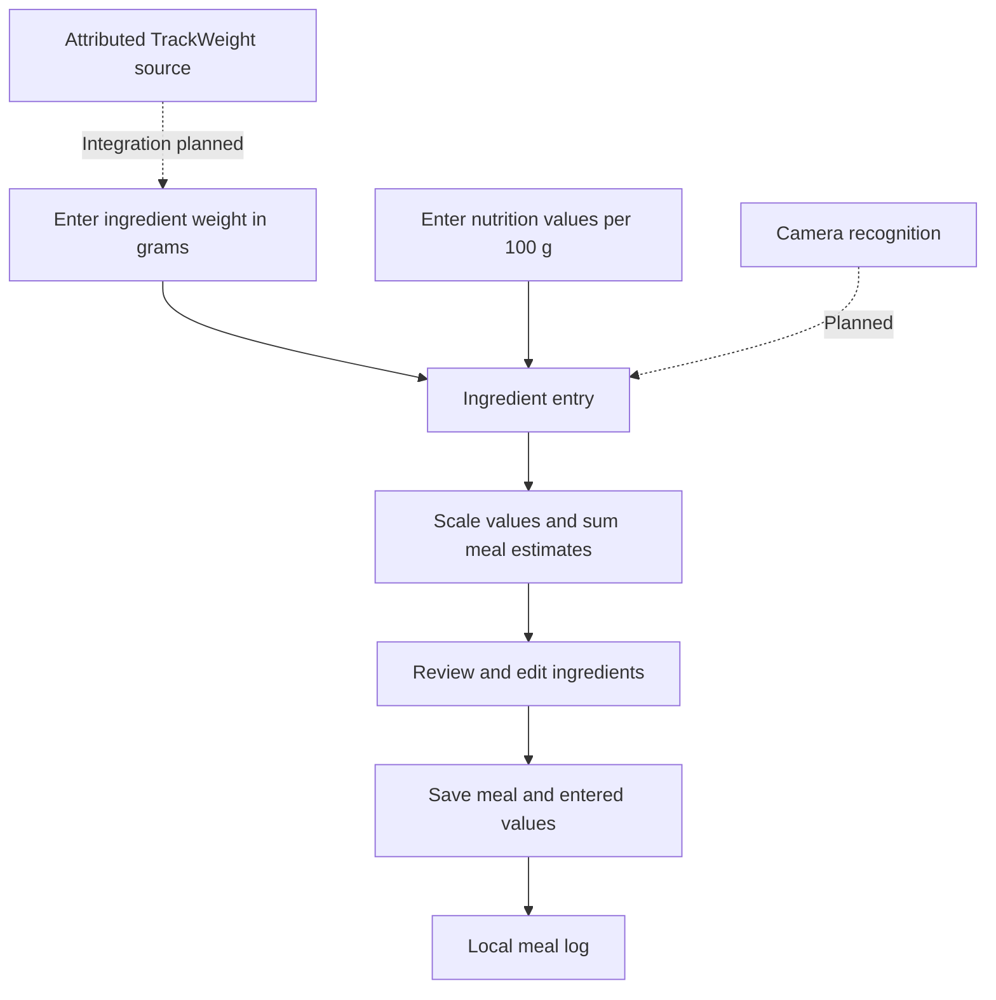

# TrackBite

A small macOS prototype for turning ingredient weights and nutrition-label values into a saved meal log. Enter ingredients manually, review estimated energy and macronutrient totals, then save the meal on your Mac.

TrackBite began as a trackpad-and-camera nutrition idea. The manual workflow is now implemented. The attributed TrackWeight weighing foundation is included separately; direct trackpad capture and camera recognition are future integration work.



Solid arrows describe the implemented manual workflow. Dashed arrows are planned integrations.

## Run it

Requires macOS 13 or later and a Swift 5.9-compatible developer toolchain.

```sh
swift run TrackBite
```

The root app has no third-party package dependencies, accounts, API keys, or network calls. Running it does not build or download the separate TrackWeight foundation.

1. Give the meal a name and choose **Add ingredient**.
2. Enter its weight in grams and the energy, protein, carbohydrate, and fat values **per 100 g** from your chosen reference. Numeric fields use a decimal point; zero is allowed for nutrients.
3. Add more ingredients or edit existing entries. The app updates the estimated totals using `grams / 100 × per-100-g value` for each ingredient, then sums the results.
4. Choose **Save meal**. Open **Meal log** to review saved ingredients, their entered values, and recalculated totals. Deletion asks for confirmation.

Weights and label values are entered by you; the app does not identify foods or verify their composition. Use matching quantities and preparation states for your inputs. Display values are rounded to one decimal place, while calculations and saved inputs retain their underlying precision. These are estimates, not dietary recommendations or medical measurements.

## Local storage

Saved meals live in `~/Library/Application Support/TrackBite/meals.json`. Saves replace the file atomically, and failed writes leave the previous log and current draft intact. If an existing log is malformed, the app preserves it and disables saving until it is repaired or restored and the app reopened. The JSON file is not encrypted.

An unsaved draft lasts only for the current app session. There is no cloud sync or coordination between separate app processes. No food diaries, real meal records, photos, datasets, or credentials are bundled.

## Architecture and checks

- `Sources/NutritionCore/`: ingredient/meal models, calculations, validation, and JSON persistence.
- `Sources/TrackBiteApp/`: SwiftUI ingredient editor, draft review, and saved meal log.
- `Tests/NutritionChecks/`: dependency-free checks with fictional arithmetic inputs and temporary files.
- `third_party/trackweight/`: attributed upstream weighing source, separate from the root app.

```sh
swift run NutritionChecks
swift build --product TrackBite
```

See [validation and implementation notes](docs/VALIDATION.md). UI interaction and physical weighing are not verified by the calculation checks.

## Weighing foundation and future work

The included [TrackWeight source reference](third_party/trackweight/README.md) comes from Krish Shah's upstream project and its OpenMultitouchSupport integration by Takuto Nakamura. Its 13 Swift files are unchanged from the recorded upstream commit; the associated MIT notices and source headers are retained. The original app still identifies itself as TrackWeight. Its code is not presented as Ved's original weighing implementation or as a connected TrackBite sensor.

The next integration could offer a reviewed weight from a compatible measuring device while preserving manual entry. Camera recognition, external nutrition lookup, automatic ingredient identification, and calorie inference from photos are not implemented. A photo and total weight alone do not establish a mixed dish's composition.

The manual nutrition workflow, focused checks, and documentation were newly implemented with AI assistance on 2026-10-08. They are new work following the concept snapshot. See [attribution and license status](ATTRIBUTION.md).
