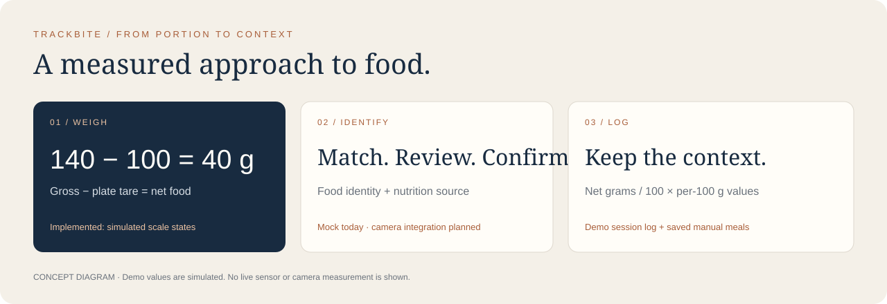

# TrackBite

TrackBite started with a student-life problem: I cared about nutrition and going to the gym, but had a limited budget and little equipment. I wondered whether my laptop’s trackpad could work like a weighing scale. That question later grew into the idea of using a camera to log food and track macros.

Today, you can try the workflow in an offline browser demo or use the native Mac app to log meals manually. The demo uses simulated weights and a mock food match; live trackpad readings and camera recognition are planned integrations.



*The workflow concept: weigh, identify, confirm, log.*

## See the demo

<p>
  
  
</p>

*Demo photos with simulated weights: empty bowl, then apples.*

Download or clone the repository, then open **[demo/TrackBite-Demo.html](demo/TrackBite-Demo.html)** in Safari or Chrome. It runs offline without a server, account or API key. Download the file first; GitHub’s viewer shows its source.

The portion studio takes you through three screens:

| Screen | What you can do |
| --- | --- |
| **01 / Weigh** | Switch between the empty plate and food states; see gross, tare and net together. |
| **02 / Ingredient** | Edit the mock food match and confirm the portion. |
| **03 / Meal log** | Review the confirmed entry and its calculation, then reset for another run. |

- **1:** empty plate, 100 g total, 100 g tare, 0 g food.
- **2:** plate and food, 140 g gross, 100 g tare, 40 g net.
- **F:** full screen. **Esc:** exit.

The sample uses fictional nutrition values: 50 kcal per 100 g gives 20 kcal for the 40 g portion. Entries reset when you change the scale state or close the page. Try it with just the keyboard; no weight needs to go on your trackpad.

## Use the native Mac app

With macOS 13+ and a Swift 5.9-compatible developer toolchain:

```sh
swift run TrackBite
```

The app opens to the scale demo. Select **Ingredients & meal log** to enter a meal name, add ingredients with their weights and nutrition values per 100 g, review the totals, and save locally. You can correct ingredients before saving; deleting a saved meal asks for confirmation.

Saved manual meals live in `~/Library/Application Support/TrackBite/meals.json`, an unencrypted local file. Demo entries are kept separate, and unsaved drafts clear on close.

## Where I want to take it

- Connect the scale workflow to a reviewed native Force Touch adapter.
- Add camera capture or photo import with food matches you can correct.
- Use attributed food-composition data with preparation and cooked/raw context.
- Keep the measurement and nutrition source alongside each saved entry.

## Hardware foundation

[TrackWeight by Krish Shah](third_party/trackweight/README.md) is included as the weighing reference, separate from the root app. It uses Force Touch hardware, capacitive contact and private multitouch access through OpenMultitouchSupport. Trackpad load limits, calibration and accuracy still need validation. See the [integration notes](docs/CONCEPT-INTEGRATION.txt) for details.

## Build and checks

```sh
swift build
swift run NutritionChecks
node scripts/check-demo.cjs
```

The root Swift package has no external dependencies and does not build or download the vendored framework. Checks cover nutrition calculations, persistence, invalid inputs, gross/tare/net arithmetic, confirmation and demo navigation. See [validation](docs/VALIDATION.md) for recorded results and remaining visual and hardware checks.

## Credits

TrackBite’s interface, nutrition workflow, mock adapters and documentation were developed with AI assistance. The weighing foundation is **TrackWeight by Krish Shah**, using **OpenMultitouchSupport by Takuto Nakamura**. Vendored source and both MIT notices are preserved unchanged. See [attribution and license status](ATTRIBUTION.md); the third-party MIT terms do not relicense original TrackBite material.
