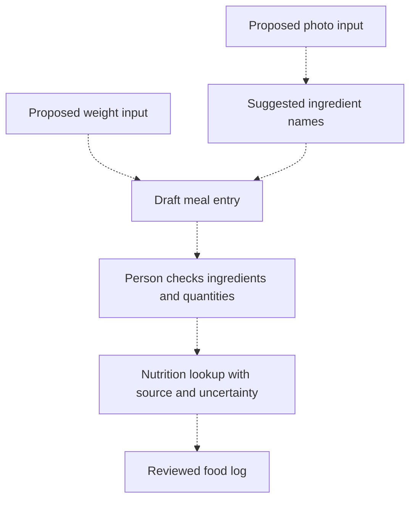

# TrackBite

**A trackpad-and-camera nutrition concept.** An idea for connecting a food-weight reading with a visual description of ingredients, then letting a person review the proposed food log before saving it.

TrackBite explores a question: could the gap between weighing a meal and recording what is in it become smaller? The proposed experience combines a scale reading, a photo, and an explicit review step. This repository documents the concept; it does not contain a working nutrition app.

All diagram steps are proposed. Camera recognition, calorie/macronutrient estimation, food-database lookup, and meal logging are not implemented.

## The proposed experience

1. Establish an empty-container weight, then capture the food's weight with an appropriate measuring device.
2. Add a photo and suggest ingredient names, while allowing manual correction or fully manual entry.
3. Ask the person to confirm the ingredients and quantities. A photo and total weight alone cannot reliably determine the composition of a mixed dish.
4. Look up nutrition from an identified source, show assumptions and uncertainty, and save only after review.

The first useful prototype could be manual: type a weight and ingredient list, then review a draft entry. That would explore the interaction before adding camera models or hardware integrations. It is a possible next step, not code that already exists here.

## Connection to TrackWeight

The weighing inspiration is [TrackWeight by Krish Shah](https://github.com/KrishKrosh/TrackWeight), an upstream application using Force Touch trackpad pressure through [OpenMultitouchSupport](https://github.com/Kyome22/OpenMultitouchSupport). That weighing implementation belongs to its upstream authors.

Ved Sarkar's TrackBite contribution is the proposed nutrition workflow described here. TrackBite does not bundle or claim authorship of TrackWeight or OpenMultitouchSupport code, and no weighing accuracy or suitability for food measurement has been established. Any future integration must preserve the upstream licenses and notices and validate the measurement setup.

## Boundaries for a first prototype

- Use fictional meal examples while developing the workflow.
- Keep photos and food logs local by default; any future off-device processing needs a clear choice and data-flow description.
- Separate measured values, user-entered values, and inferred values in the interface.
- Treat ingredient recognition as a suggestion and nutrition estimates as uncertain, especially for mixed dishes.

No API keys, patient records, food diaries, photographs, datasets, dependencies, or model calls are included. No application tests or accuracy results are claimed. See [attribution and license status](ATTRIBUTION.md).
